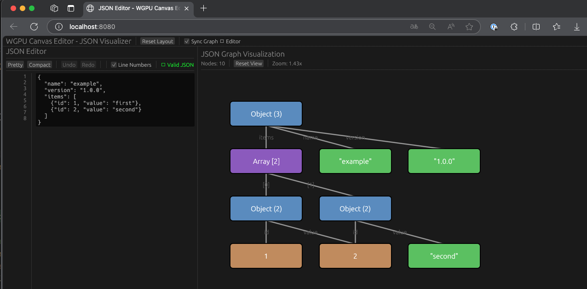

# WGPU JSON Editor

A high-performance, cross-platform JSON editor built with Rust, wgpu, and egui. This application provides a professional IDE-like JSON editing experience that runs on both desktop and web platforms using the same codebase.

## Overview

This project demonstrates a modern approach to building graphics-intensive applications with rich UI that work seamlessly across desktop and web. It leverages Rust's performance and safety guarantees along with wgpu's portable graphics API and egui's immediate-mode GUI framework to deliver a VSCode-like JSON editing experience.

## Live Demo

**Try it now:** [https://zlcjfalsvk.github.io/Json-Editor/](https://zlcjfalsvk.github.io/Json-Editor/)

The web version runs directly in your browser using WebAssembly and WebGPU. No installation required!

> **Note:** Requires a WebGPU-compatible browser (Chrome 113+, Firefox 121+, Safari 18+)

## Screenshots

| Desktop Application | Web Application (WASM) |
|:-------------------:|:----------------------:|
|  |  |
| Native desktop application running with wgpu<br/>on Vulkan/Metal/DX12 | Web application running in browser<br/>with WebGPU |

## Features

### JSON Editor (Left Panel)
- **Real-time syntax validation** with error messages
- **Pretty print and compact formatting**
- **Undo/Redo functionality** - Per-character undo/redo with history stack (max 100 items)
- **Line numbers** with toggle option
- **Synchronized scrolling** between line numbers and editor
- **Focus retention** when JSON syntax errors occur
- **Monospace code editor** with full-height panel
- **Clipboard support** - Native copy/paste operations with undo/redo

### JSON Graph Visualizer (Right Panel)
- **Visual graph representation** of JSON structure
- **Interactive node visualization** with color-coded types
- **Sync Graph → Editor** checkbox for future integration

### Cross-Platform Support
- **Desktop**: Native performance with wgpu on Vulkan/Metal/DX12
- **Web**: Near-native performance via WebAssembly and WebGPU
- **Responsive UI** that adapts to window resizing
- **Fullscreen editor mode** on web (VSCode-like experience)

## Technology Stack

- **Rust 2024**: Latest edition with improved ergonomics and features
- **wgpu**: Safe, portable graphics API (Vulkan, Metal, DX12, WebGPU)
- **egui**: Immediate-mode GUI framework for rich UI
- **winit**: Cross-platform window management
- **serde/serde_json**: JSON parsing and serialization
- **wasm-bindgen**: Rust-WASM interop for web deployment
- **webpack**: Web bundling and development server

## Project Structure

```
wgpu-example/
├── src/
│   ├── lib.rs              # Common library and WASM exports
│   ├── main.rs             # Desktop application entry point
│   ├── app.rs              # Application UI logic
│   ├── state.rs            # Application state management
│   ├── input.rs            # Input event handling
│   ├── json_editor/        # JSON editor module
│   │   ├── mod.rs          # Module exports
│   │   ├── editor.rs       # JSON editing functionality
│   │   └── graph.rs        # Graph visualization
│   └── renderer/
│       ├── mod.rs          # Renderer module
│       └── canvas.rs       # Canvas rendering implementation
├── web/
│   ├── index.html          # Web application HTML
│   ├── index.js            # JavaScript entry point
│   ├── package.json        # Node.js dependencies
│   └── webpack.config.js   # Webpack configuration
├── tests/
│   └── integration_test.rs # Integration tests
├── .claude/
│   └── claude.md           # Project context for AI assistants
├── .github/
│   └── workflows/
│       └── ci.yml          # CI/CD pipeline
├── Cargo.toml              # Rust dependencies
├── build.rs                # Build script
└── README.md               # This file
```

## Prerequisites

### For Desktop Build
- Rust 1.85+ with Rust 2024 edition support
- Cargo

### For Web Build
- Rust with `wasm32-unknown-unknown` target
- wasm-pack: `cargo install wasm-pack`
- Node.js 18+ and npm

## Quick Start

### Desktop Application

The fastest way to get started:

```bash
# Clone the repository (if from a remote source)
# git clone <repository-url>
# cd wgpu-canvas-editor

# Build and run
cargo run --release
```

The application will open a window with the JSON editor in the left panel and graph visualizer in the right panel.

**Controls:**
- Type JSON in the left panel editor
- Use **Ctrl+Z** / **Ctrl+Shift+Z** (or **Cmd+Z** / **Cmd+Shift+Z** on macOS) for undo/redo
- Click **Pretty** or **Compact** buttons to format JSON
- Toggle **Line Numbers** checkbox to show/hide line numbers
- Press `ESC` to close the application
- Window is resizable with responsive panels

### Web Application (WASM)

Complete WASM build and deployment:

```bash
# Step 1: Add the WASM target (first time only)
rustup target add wasm32-unknown-unknown

# Step 2: Install wasm-pack (first time only)
cargo install wasm-pack

# Step 3: Install web dependencies
cd web
npm install

# Step 4: Build and start development server
npm run dev
```

The browser will automatically open to `http://localhost:8080` showing the fullscreen JSON editor.

**Note:** Ensure your browser supports WebGPU (Chrome 113+, Firefox 121+, Safari 18+).

## Building and Running

### Desktop Application - Detailed

1. **Development build** (faster compilation, debug symbols):
```bash
cargo build
cargo run
```

2. **Release build** (optimized, slower compilation):
```bash
cargo build --release
cargo run --release
```

3. **With logging enabled**:
```bash
RUST_LOG=info cargo run
# or for more verbose output
RUST_LOG=debug cargo run
```

### Web Application (WASM) - Detailed

1. **Install prerequisites** (one-time setup):
```bash
# Install Rust WASM target
rustup target add wasm32-unknown-unknown

# Install wasm-pack
cargo install wasm-pack

# Install Node.js dependencies
cd web && npm install && cd ..
```

2. **Available npm scripts**:
```bash
cd web

# Development mode (builds WASM in dev mode and starts server)
npm run dev

# Start dev server only (assumes WASM is already built)
npm start

# Build WASM module only (development)
npm run wasm:dev

# Build WASM module only (release)
npm run wasm:build

# Production build
npm run build

# Serve pre-built files
npm run serve
```

3. **Manual WASM build** (if needed):
```bash
# Development build
wasm-pack build --target web --dev --out-dir web/pkg

# Release build (optimized)
wasm-pack build --target web --release --out-dir web/pkg
```

This creates a `web/pkg/` directory with:
- `wgpu_canvas_editor_bg.wasm` - The WebAssembly binary
- `wgpu_canvas_editor.js` - JavaScript bindings
- `wgpu_canvas_editor.d.ts` - TypeScript definitions

### Running Tests

Execute the test suite:
```bash
cargo test --all
```

Run tests with output:
```bash
cargo test -- --nocapture
```

### Pre-Commit Verification

Before committing code, run these checks (as specified in `.claude/claude.md`):

```bash
# 1. Format check
cargo fmt --all -- --check

# 2. Linting
cargo clippy --all-targets --all-features -- -D warnings

# 3. Tests
cargo test --all

# 4. Desktop build
cargo build --release

# 5. WASM build (if web-related changes)
wasm-pack build --target web --out-dir web/pkg
```

## Development

### Code Formatting
```bash
cargo fmt --all
```

### Linting
```bash
cargo clippy --all-targets --all-features
```

### Watch Mode (Desktop)
```bash
cargo watch -x run
```

## Architecture

### Application Layer (`src/app.rs`)
The main application UI logic using egui:
- Top panel with controls and sync options
- Left panel (JSON editor)
- Central panel (graph visualizer)
- Layout management and resizing

### JSON Editor Module (`src/json_editor/`)

**Editor** (`editor.rs`):
- Real-time JSON validation with serde_json
- Undo/redo with bounded history stack
- Line number display with synchronized scrolling
- Focus management for improved UX
- Pretty print and compact formatting

**Graph** (`graph.rs`):
- Visual representation of JSON structure
- Node-based visualization with type colors
- Interactive graph rendering

### State Management (`src/state.rs`)
Maintains application state including:
- egui context management
- Renderer integration
- Event handling coordination

### Renderer (`src/renderer/`)
The renderer module handles all wgpu-related operations:
- Graphics device initialization
- Render pipeline setup
- Surface configuration
- Integration with egui renderer

### Input Handling (`src/input.rs`)
Processes user input events:
- Mouse movements and clicks
- Keyboard shortcuts
- Window events

### Platform Abstraction
- **Desktop**: Uses `winit` for window management and event loop
- **Web**: Uses `wasm-bindgen` and `web-sys` for browser integration

## Features Roadmap

### Phase 1: Foundation ✅
- [x] Basic wgpu renderer setup
- [x] Cross-platform window management (desktop + web)
- [x] egui integration for UI
- [x] JSON editor with syntax validation
- [x] JSON graph visualizer
- [x] Undo/redo functionality (per-character)
- [x] Line numbers with synchronized scrolling
- [x] Focus management in UI
- [x] WASM build support
- [x] Fullscreen web interface

### Phase 2: Enhanced JSON Editing (In Progress)
- [ ] Syntax highlighting with VSCode theme
- [ ] Click on graph node to jump to line in editor
- [ ] Search and replace functionality
- [ ] Bracket matching and auto-completion
- [ ] JSON schema validation
- [ ] Multiple file tabs

### Phase 3: Advanced Features
- [ ] JSON path navigation
- [ ] Tree view for JSON structure
- [ ] Diff view for comparing JSON files
- [ ] Import/Export various formats (YAML, TOML, XML)
- [ ] Custom themes and color schemes
- [ ] Keyboard shortcut customization

### Phase 4: Collaboration & Export
- [ ] Export to PNG/SVG (graph visualization)
- [ ] Performance optimization for large JSON files
- [ ] Mobile touch support
- [ ] Real-time collaborative editing
- [ ] Cloud storage integration

## Performance

The application is designed for high performance:
- GPU-accelerated rendering via wgpu
- Efficient state management with egui's immediate-mode paradigm
- Optimized text rendering with monospace fonts
- Bounded undo/redo history (max 100 items) for memory efficiency
- Lazy validation and parsing
- Small WASM binary size with optimized builds

## Browser Support (WASM)

- Chrome/Edge 113+ (WebGPU support)
- Firefox 121+ (WebGPU support)
- Safari 18+ (WebGPU support)

Note: WebGPU is still in active development. Check [caniuse.com](https://caniuse.com/webgpu) for latest support.

## Contributing

Contributions are welcome! Please follow these guidelines:

1. Fork the repository
2. Create a feature branch
3. Make your changes with tests
4. Run pre-commit verification checks (see above)
5. Test both desktop and web builds
6. Submit a pull request

## Troubleshooting

### Desktop Issues

**Window doesn't open:**
- Ensure graphics drivers are up to date
- Check GPU compatibility with Vulkan/Metal/DX12

**UI rendering issues:**
- Verify egui is properly initialized
- Check console for error messages

### Web Issues

**WASM module fails to load:**
- Ensure wasm-pack build completed successfully
- Check browser console for errors
- Verify WebGPU is enabled in your browser

**Editor not responding:**
- Try Chrome/Edge for best WebGPU performance
- Check browser task manager for GPU usage
- Clear browser cache and reload

**Text input issues:**
- Ensure focus is on the text editor
- Check browser console for JavaScript errors

### JSON Editor Issues

**Undo/Redo not working:**
- Undo/redo works per-character and clipboard operation
- Maximum 100 undo steps are preserved
- Check browser console for any errors

**Line numbers not syncing:**
- Line numbers scroll synchronously with editor
- Try toggling line numbers off and on

## License

MIT License - See LICENSE file for details

## Acknowledgments

- [wgpu](https://wgpu.rs/) - Portable graphics library
- [egui](https://www.egui.rs/) - Immediate-mode GUI framework
- [winit](https://github.com/rust-windowing/winit) - Window management
- [serde](https://serde.rs/) - Serialization framework
- [Learn wgpu Tutorial](https://sotrh.github.io/learn-wgpu/) - Excellent learning resource

## Resources

- [wgpu Documentation](https://docs.rs/wgpu/)
- [egui Documentation](https://docs.rs/egui/)
- [Rust WebAssembly Book](https://rustwasm.github.io/docs/book/)
- [winit Documentation](https://docs.rs/winit/)

## Contact

For questions or feedback, please open an issue on GitHub.

---

Built with ❤️ using Rust 🦀 and WebGPU 🎨
