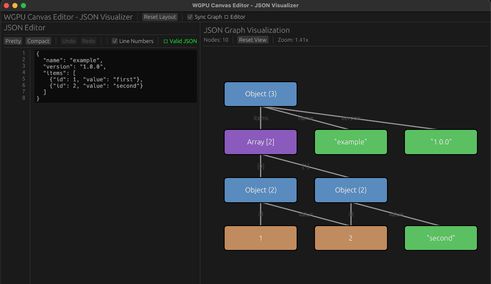

# WGPU Canvas Editor

A high-performance, cross-platform canvas editor built with Rust and wgpu, inspired by Figma's design interface.

## Overview

This project demonstrates a modern approach to building graphics-intensive applications that run on both desktop and web platforms using the same codebase. It leverages Rust's performance and safety guarantees along with wgpu's portable graphics API.

## Screenshots

| Desktop Application | Web Application (WASM) |
|:-------------------:|:----------------------:|
|  |  |
| Native desktop application running with wgpu<br/>on Vulkan/Metal/DX12 | Web application running in browser<br/>with WebGPU |

## Features

- Cross-platform rendering (Desktop & Web via WASM)
- Hardware-accelerated graphics using wgpu
- Modern Rust 2024 edition
- Basic shape rendering and canvas management
- Responsive event handling

## Technology Stack

- **Rust 2024**: Latest edition with improved ergonomics and features
- **wgpu**: Safe, portable graphics API (Vulkan, Metal, DX12, WebGPU)
- **winit**: Cross-platform window management
- **wasm-bindgen**: Rust-WASM interop for web deployment
- **webpack**: Web bundling and development server

## Project Structure

```
wgpu-example/
├── src/
│   ├── lib.rs              # Common library and WASM exports
│   ├── main.rs             # Desktop application entry point
│   ├── renderer/
│   │   ├── mod.rs          # Renderer module
│   │   └── canvas.rs       # Canvas rendering implementation
│   ├── state.rs            # Application state management
│   └── input.rs            # Input event handling
├── web/
│   ├── index.html          # Web application HTML
│   ├── index.js            # JavaScript entry point
│   ├── package.json        # Node.js dependencies
│   └── webpack.config.js   # Webpack configuration
├── tests/
│   └── integration_test.rs # Integration tests
├── .github/
│   └── workflows/
│       └── ci.yml          # CI/CD pipeline
├── Cargo.toml              # Rust dependencies
├── build.rs                # Build script
└── README.md               # This file
```

## Prerequisites

### For Desktop Build
- Rust 1.75+ with Rust 2024 edition support
- Cargo

### For Web Build
- Rust with `wasm32-unknown-unknown` target
- wasm-pack: `cargo install wasm-pack`
- Node.js 18+ and npm

## Quick Start

### Desktop Application

The fastest way to get started:

```bash
# Clone the repository (if from a remote source)
# git clone <repository-url>
# cd wgpu-canvas-editor

# Build and run
cargo run --release
```

The application will open a window with an 800x600 canvas displaying a colorful triangle (red, green, blue vertices).

**Controls:**
- Press `ESC` to close the application
- Window is resizable

### Web Application (WASM)

Complete WASM build and deployment:

```bash
# Step 1: Add the WASM target (first time only)
rustup target add wasm32-unknown-unknown

# Step 2: Install wasm-pack (first time only)
cargo install wasm-pack

# Step 3: Build the WASM module
wasm-pack build --target web --release

# Step 4: Install web dependencies
cd web
npm install

# Step 5: Start the development server
npm run serve
```

The browser will automatically open to `http://localhost:8080` showing the canvas editor.

**Note:** Ensure your browser supports WebGPU (Chrome 113+, Firefox 121+, Safari 18+).

## Building and Running

### Desktop Application - Detailed

1. **Development build** (faster compilation, debug symbols):
```bash
cargo build
cargo run
```

2. **Release build** (optimized, slower compilation):
```bash
cargo build --release
cargo run --release
```

3. **With logging enabled**:
```bash
RUST_LOG=info cargo run
# or for more verbose output
RUST_LOG=debug cargo run
```

### Web Application (WASM) - Detailed

1. **Install prerequisites** (one-time setup):
```bash
# Install Rust WASM target
rustup target add wasm32-unknown-unknown

# Install wasm-pack
cargo install wasm-pack

# Install Node.js dependencies
cd web && npm install && cd ..
```

2. **Build the WASM module**:
```bash
# Development build
wasm-pack build --target web --dev

# Release build (optimized)
wasm-pack build --target web --release
```

This creates a `pkg/` directory with:
- `wgpu_canvas_editor_bg.wasm` - The WebAssembly binary
- `wgpu_canvas_editor.js` - JavaScript bindings
- `wgpu_canvas_editor.d.ts` - TypeScript definitions

3. **Run the development server**:
```bash
cd web
npm run serve
```

4. **Build for production**:
```bash
cd web
npm run build
```

The production build will be in `web/dist/` and can be deployed to any static hosting service.

5. **Clean build artifacts**:
```bash
cd web
npm run clean
```

### Running Tests

Execute the test suite:
```bash
cargo test
```

Run tests with output:
```bash
cargo test -- --nocapture
```

## Development

### Code Formatting
```bash
cargo fmt
```

### Linting
```bash
cargo clippy
```

### Watch Mode (Desktop)
```bash
cargo watch -x run
```

## Architecture

### Renderer (`src/renderer/`)
The renderer module handles all wgpu-related operations:
- Graphics device initialization
- Render pipeline setup
- Shader management
- Draw call execution

### State Management (`src/state.rs`)
Maintains application state including:
- Canvas objects and their properties
- User selections
- Viewport transformations

### Input Handling (`src/input.rs`)
Processes user input events:
- Mouse movements and clicks
- Keyboard shortcuts
- Touch events (web only)

### Platform Abstraction
- **Desktop**: Uses `winit` for window management and event loop
- **Web**: Uses `wasm-bindgen` and `web-sys` for browser integration

## Development Roadmap

### Phase 1: Foundation ✓
- [x] Project setup and structure
- [x] Basic wgpu renderer
- [x] Desktop window management
- [x] WASM web support
- [x] Simple triangle rendering

### Phase 2: Core Features (In Progress)
- [ ] Shape primitives (rectangles, circles, lines)
- [ ] Shape selection and manipulation
- [ ] Pan and zoom controls
- [ ] Basic keyboard shortcuts

### Phase 3: Advanced Editing
- [ ] Layer management system
- [ ] Undo/redo functionality
- [ ] Copy/paste operations
- [ ] Transform tools (rotate, scale)

### Phase 4: Polish & Export
- [ ] Export to PNG/SVG formats
- [ ] Performance optimization
- [ ] Mobile touch support
- [ ] Collaborative editing

## Performance

The application is designed for high performance:
- GPU-accelerated rendering via wgpu
- Efficient state management with minimal redraws
- Instanced rendering for multiple objects
- Optimized WASM binary size

## Browser Support (WASM)

- Chrome/Edge 113+ (WebGPU support)
- Firefox 121+ (WebGPU support)
- Safari 18+ (WebGPU support)

Note: WebGPU is still in active development. Check [caniuse.com](https://caniuse.com/webgpu) for latest support.

## Contributing

Contributions are welcome! Please follow these guidelines:

1. Fork the repository
2. Create a feature branch
3. Make your changes with tests
4. Run `cargo fmt` and `cargo clippy`
5. Test both desktop and web builds
6. Submit a pull request

## Troubleshooting

### Desktop Issues

**Window doesn't open:**
- Ensure graphics drivers are up to date
- Check GPU compatibility with Vulkan/Metal/DX12

**Black screen:**
- Verify shader compilation succeeded
- Check console for error messages

### Web Issues

**WASM module fails to load:**
- Ensure wasm-pack build completed successfully
- Check browser console for errors
- Verify WebGPU is enabled in your browser

**Performance issues:**
- Try Chrome/Edge for best WebGPU performance
- Check browser task manager for GPU usage
- Consider reducing canvas size

## License

MIT License - See LICENSE file for details

## Acknowledgments

- [wgpu](https://wgpu.rs/) - Portable graphics library
- [winit](https://github.com/rust-windowing/winit) - Window management
- [Learn wgpu Tutorial](https://sotrh.github.io/learn-wgpu/) - Excellent learning resource

## Contact

For questions or feedback, please open an issue on GitHub.

---

Built with ❤️ using Rust 🦀
